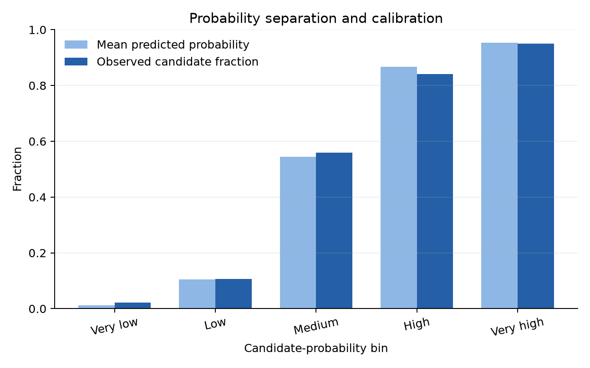

# Kepler Signals Under Uncertainty

[](https://github.com/MaryamSa/Robust-prediction-under-uncertainty/actions/workflows/ci.yml)

## Aim

This project estimates the probability that a **Kepler transit-like signal is labelled a planet candidate rather than a false positive** in NASA's uniform Q1–Q17 DR25 table. It compares a transparent statistical baseline with a non-linear machine-learning challenger, calibrates the chosen probabilities, and tests how missing data, sampling variation, host-star grouping, and reported measurement errors affect the result.

> A Kepler `CANDIDATE` is not a confirmed planet. This is a modelling and uncertainty-analysis project, not an automated exoplanet-validation system.

## Why the methods are transferable

The astronomy question is specific; the analysis pattern is general.

| General method | Here | Banking / insurance | Energy / industry |
|---|---|---|---|
| Probabilistic classification | Candidate vs false-positive signal | Default, fraud, churn, or claim probability | Fault, outage, or event probability |
| Entity-grouped validation | Keep one host star in one fold | Keep one customer/company in one fold | Keep one site, turbine, or asset in one fold |
| Probability calibration | Does 70% mean about 7 in 10? | Reliable risk estimates and score bands | Reliable event probabilities and alerts |
| Baseline/challenger rule | Logistic regression vs gradient boosting | Complexity must earn measurable value | Compare interpretable and flexible models |
| Bootstrap uncertainty | Confidence interval around AUC/Brier | Uncertainty around validation metrics | Uncertainty around forecast/model skill |
| Measurement-error Monte Carlo | Perturb inputs by quoted astronomy errors | Noisy or estimated customer/economic inputs | Sensor and forecast-input uncertainty |
| Performance slices | Bright/faint and low/high-SNR signals | Portfolio or customer segments | Regions, assets, seasons, or operating regimes |

The code does not claim banking or energy-domain expertise. It demonstrates methods that transfer after the target, data-generating process, costs, governance, and domain rules are redefined.

## Analysis design

Two candidates are compared:

1. **Logistic regression** — a transparent statistical baseline with reviewable coefficient directions.
2. **Gradient boosting** — a machine-learning challenger that can learn non-linear thresholds and interactions.

The challenger is accepted only if selection-sample Gini improves by at least 0.02 and the Brier score does not worsen. The selected estimator is refitted and then calibrated on separate data. Final metrics come from a test fold not used for fitting, selection, or calibration.

All signals around the same host star stay in the same fold. This prevents the model from seeing one object from a planetary system during training and a sibling object from the same system during testing.

The analysis includes:

- median imputation fitted only on training data;
- log transforms for strongly skewed positive measurements;
- grouped five-fold cross-validation;
- ROC-AUC, Gini, Brier score, log loss, and calibration diagnostics;
- 500 bootstrap resamples for metric uncertainty;
- 100 Monte Carlo draws using quoted measurement errors;
- fixed probability bins, permutation importance, and performance slices;
- a model card, decision log, validation report, tests, and CI.



## Results

The predeclared rule selected **gradient boosting**. On the untouched, host-star-isolated test fold (1,610 signals), it achieved:

| Diagnostic | Result | What it answers |
|---|---:|---|
| ROC-AUC | 0.928 | How well does the model rank candidates above false positives? |
| Gini | 0.856 | The same ranking skill on a scale often used in risk modelling. |
| Brier score | 0.104 | How close are the predicted probabilities to the observed 0/1 outcomes? Lower is better. |
| Calibration error | 0.020 | Across probability bins, how far apart are predictions and observed rates? Lower is better. |

The 500-resample bootstrap interval was **0.915–0.940 for ROC-AUC** and **0.094–0.115 for Brier score**. Reported measurement errors also mattered: across 100 Monte Carlo draws, the median width of a signal's 90% probability interval was **0.127**, and 34.7% of test signals had an interval wider than 0.20. These are empirical results for this fixed catalogue—not guarantees for new surveys or other domains.

Detailed generated outputs are available in:

- [validation report](docs/VALIDATION_REPORT.md);
- [model card](docs/MODEL_CARD.md);
- [calibration plot](artifacts/figures/calibration.png);
- [ROC curve](artifacts/figures/roc_curve.png);
- [model comparison](artifacts/figures/model_comparison.png);
- [feature importance](artifacts/figures/feature_importance.png);
- [measurement-uncertainty plot](artifacts/figures/measurement_uncertainty.png);
- machine-readable [metrics](artifacts/metrics.json) and [tables](artifacts/tables/).

## Reproduce the project

Python 3.10 or newer is required.

```bash
python -m venv .venv
source .venv/bin/activate
python -m pip install -r requirements-dev.txt
make analysis
make test
make lint
```

The first run downloads the 8,054-row [NASA Kepler Q1–Q17 DR25 KOI table](https://exoplanetarchive.ipac.caltech.edu/docs/Kepler_KOI_docs.html) through the archive's TAP service. The fixed table is identified by DOI [10.26133/NEA5](https://doi.org/10.26133/NEA5). Raw data and the fitted model remain untracked; reports, tables, and figures are generated from code with a fixed seed.

## Repository guide

```text
src/kepler_uncertainty/   data, models, metrics, uncertainty, plots, pipeline
tests/                    unit tests for calculations and design controls
docs/PLAIN_LANGUAGE.md    all ML and statistics explained without jargon
docs/METHODOLOGY.md       design, assumptions, validation, and limitations
docs/DECISION_LOG.md      choices, alternatives, and remaining risks
docs/TRANSFERABILITY.md   what transfers across sectors—and what does not
docs/MODEL_CARD.md        intended use, prohibited claims, and controls
docs/VALIDATION_REPORT.md generated results and validation opinion
artifacts/                generated metrics, tables, and figures
```

## Start here if you are not a modeller

Read [The analysis in plain language](docs/PLAIN_LANGUAGE.md). It explains supervised learning, features and labels, leakage, grouped data splitting, missing-data imputation, logistic regression, gradient boosting, calibration, AUC/Gini, Brier score, bootstrap intervals, Monte Carlo uncertainty, permutation importance, and monitoring slices.

## Important limitations

- The target is a DR25 pipeline disposition, not physical ground truth or confirmed-planet status.
- Some inputs are derived from the same transit fits used in vetting, so this is not an independent discovery pipeline.
- The model uses catalogue summaries, not pixels, light curves, centroid diagnostics, or follow-up observations.
- A grouped random test cannot establish performance on another survey, mission, epoch, or population.
- The Monte Carlo analysis treats reported measurement errors as independent and approximately normal.
- No single performance metric or threshold is universally “good”; suitability depends on the use case and its costs.

These limitations are part of the result, not details to hide.

## Licence and attribution

Code is released under the [MIT License](LICENSE). NASA Exoplanet Archive attribution and the exact data choices are recorded in [data/README.md](data/README.md).
